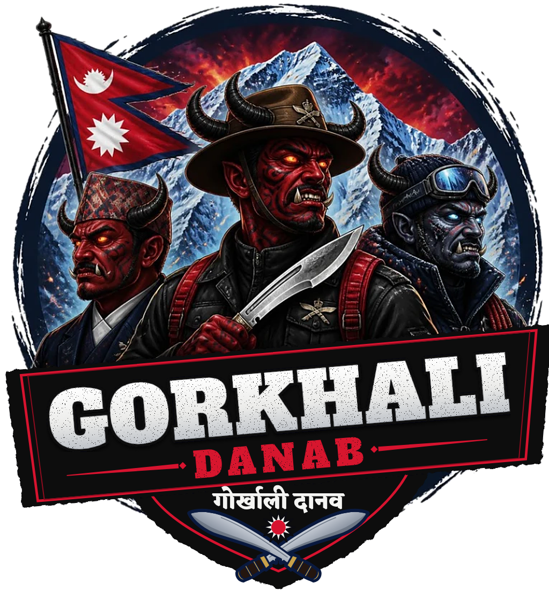
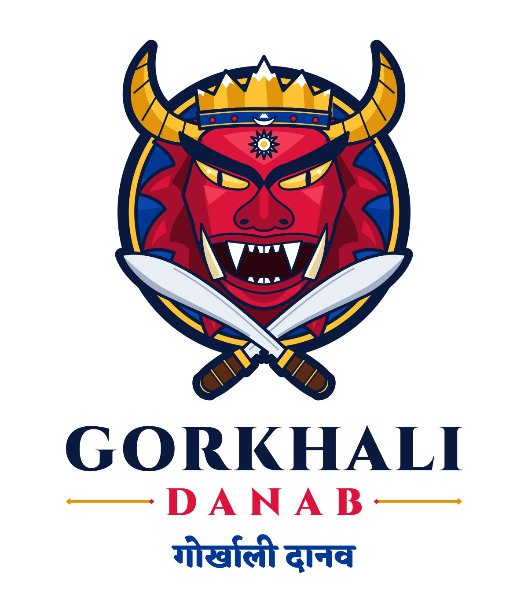

# Gorkhali Danab · गोर्खाली दानव

<p align="center">
  
</p>

## Badge (primary)

Three Gorkhali warriors as *danab*: a Gurkha soldier in a slouch hat with the crossed-khukuri cap badge, a man in a Dhaka topi, and a Himalayan mountaineer. They stand before Sagarmatha (Everest), with the Nepal flag flying beside them.

The painted scene is finished with vector art, so the details that matter stay exact:

- **Banner lettering:** crisp *GORKHALI DANAB* in Alfa Slab One, with a light distressed texture.
- **Name in Nepali:** गोर्खाली दानव in Devanagari.
- **Khukuris:** a true crossed pair, with the forward-bent blade and the *cho* notch at the guard.
- **Sun:** the flag's twelve-rayed sun, placed between the blades.

| File | Use |
| --- | --- |
| `logo/badge/gorkhali-danab-badge.png` | Transparent, 1530 × 1660 px: social media, posters, print up to about 13 cm |
| `logo/badge/gorkhali-danab-badge-1024.png` | Transparent, 1024 px wide: web and documents |
| `logo/badge/gorkhali-danab-badge-white.jpg` | On white, for places that do not accept transparency |

## Letterhead

`letterhead/Gorkhali-Danab-Letterhead.docx` is an A4 Word letterhead. It has:

- **Header:** the badge, the wordmark with गोर्खाली दानव, and a contact block.
- **Rule:** a crimson-over-blue line in the flag's colours.
- **Footer:** registration and PAN numbers.
- **Watermark:** a faint badge behind the text.
- **Letter body:** a Nepali office-style layout with पत्र संख्या / Ref. No., चलानी नं. / Dispatch No., मिति / Date, विषय / Subject and a signature block.

Replace the `[bracketed]` placeholders with your details. The header, footer and watermark repeat on every page.

## Vector emblem

<p align="center">
  
</p>

A fully vector alternative for embroidery, laser cutting, stamps and very large prints.

The mark is a fierce *danab* (दानव, demon) built entirely from symbols of Nepal:

| Element | Meaning |
| --- | --- |
| **Lakhey mask face** | The red, fanged, wild-maned demon of Newar festivals in Kathmandu valley: a protector, not a villain |
| **Himalayan crown** | Snow-capped peaks with Sagarmatha (Everest) at the centre, lit from the upper left |
| **Crescent horns** | Together the horns form an upturned crescent, echoing the moon on the flag |
| **Moon on the crown band** | The flag's rayed moon, set on the flag's border blue |
| **Third eye** | The flag's twelve-rayed white sun, placed directly below the moon as on the flag |
| **Crossed khukuris** | The blade of the Gorkhali (Gurkha) soldier, crossed as on the regimental badge |
| **Crimson and blue** | Nepal's national colours: crimson for the rhododendron and courage, blue for peace |
| **Devanagari name** | गोर्खाली दानव, so the name reads in Nepali as well as in English |

### Vector files

| File | Use |
| --- | --- |
| `logo/gorkhali-danab-logo.svg` | Primary vertical logo on light backgrounds |
| `logo/gorkhali-danab-logo-dark.svg` | Primary vertical logo on navy |
| `logo/gorkhali-danab-horizontal.svg` | Wide layout for headers, banners, jerseys |
| `logo/gorkhali-danab-horizontal-dark.svg` | Wide layout on navy |
| `logo/gorkhali-danab-emblem.svg` | Emblem only, for avatars, favicons, stickers, patches |
| `logo/png/` | PNG exports: emblem at 32 to 2048 px, logos at 1x and 2x |

All text is converted to outlines, so the SVGs render identically everywhere without installing fonts.

## Colours (vector emblem)

| Swatch | Hex | Role |
| --- | --- | --- |
| Crimson | `#DC143C` | Nepal flag crimson: face, *DANAB* |
| Flag blue | `#003893` | Nepal flag border: badge, crown band, Devanagari |
| Night navy | `#0A1A3F` | Outlines, *GORKHALI*, dark backgrounds |
| Marigold gold | `#FFC233` | Crown, horns, badge ring |
| Snow white | `#FFFFFF` | Sun, moon, snow caps, fangs |

## Typography

- **Alfa Slab One**: badge banner and letterhead wordmark
- **Cinzel Black**: vector emblem wordmark
- **Eczar ExtraBold**: गोर्खाली दानव

All three typefaces are free under the SIL Open Font License.

## Editing the logo

The artwork is generated from code in `logo/src/`, so you can change shapes, colours or proportions and rebuild every file at once:

```bash
pip install fonttools uharfbuzz
npm install playwright          # or point NODE_PATH at a global install
logo/src/build.sh               # downloads the fonts on first run
```

`emblem.py` draws the vector emblem, and `lockup.py` sets its wordmark and writes all five SVGs. `badge.py` lays the banner, shield and lettering over the painting in `logo/badge/source/`. `build.sh` then exports the PNGs.

To rebuild the letterhead after changing its text or images, run `NODE_PATH=$(npm root -g) letterhead/src/build.sh`. It needs the `docx` npm package.
